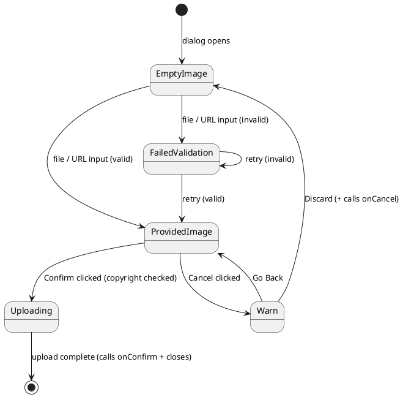

{/* image-upload-dialog.mdx */}
import { Meta, Canvas } from '@storybook/addon-docs/blocks';
import * as Stories from './image-upload-dialog.stories';

<Meta of={Stories} />

# ImageUploadDialog

Full-flow image upload orchestrator for the Arda design system. Manages a five-state
machine &#8212; **EmptyImage**, **ProvidedImage**, **FailedValidation**, **Uploading**, and
**Warn** &#8212; coordinating drop zone, preview editor, copyright gate, progress bar,
and discard guard in a single Dialog surface.

**Organism** &#8212; Canary | Import: `@/components/canary/organisms/shared/image-upload-dialog`

---

## State Machine

The component is driven by `useReducer`. The diagram below shows all states and transitions.



---

## Playground

Use the Controls panel to toggle `open`, `existingImageUrl`, and `config`. Actions log
`onConfirm` and `onCancel`.

<Canvas of={Stories.Playground} />

---

## Empty Image State

The dialog opens showing `ImageDropZone` &#8212; the entry state on every open.

<Canvas of={Stories.EmptyImageState} />

---

## Provided Image State

Once an image is staged, `ImagePreviewEditor` replaces the drop zone and
`CopyrightAcknowledgment` appears below. The Confirm button is disabled until the
copyright checkbox is checked.

<Canvas of={Stories.ProvidedImageState} />

---

## Comparison Mode

When `existingImageUrl` is set, `ImageComparisonLayout` wraps the preview editor to show
a side-by-side (desktop) or tabbed (mobile) comparison.

<Canvas of={Stories.ComparisonMode} />

---

## Validation Error

An inline `text-destructive` error message is shown above a fresh `ImageDropZone` when
input fails validation.

<Canvas of={Stories.ValidationError} />

---

## Copyright Gate

The Confirm button remains disabled until the user checks the copyright acknowledgment
checkbox.

<Canvas of={Stories.CopyrightGate} />

---

## Upload Progress

After Confirm is clicked, the footer is replaced by a `Progress` bar and a disabled
"Uploading&#8230;" button.

<Canvas of={Stories.UploadProgress} />

---

## Warn on Discard

Clicking Cancel while an image is staged shows an `AlertDialog` guard with **Discard**
(destructive) and **Go Back** actions.

<Canvas of={Stories.WarnOnDiscard} />

---

## Full Happy Path

Interactive end-to-end: open &#8594; drop file &#8594; preview &#8594; copyright &#8594; confirm
&#8594; progress &#8594; close.

<Canvas of={Stories.FullHappyPath} />

---

## Props

<table>
  <thead>
    <tr>
      <th>Prop</th>
      <th>Category</th>
      <th>Type</th>
      <th>Default</th>
      <th>Description</th>
    </tr>
  </thead>
  <tbody>
    <tr>
      <td><code>config</code></td>
      <td>Init</td>
      <td><code>ImageFieldConfig</code></td>
      <td>Required</td>
      <td>
        Combined static + init field configuration: aspect ratio, accepted formats,
        size limits, and display names.
      </td>
    </tr>
    <tr>
      <td><code>open</code></td>
      <td>Runtime</td>
      <td><code>boolean</code></td>
      <td>Required</td>
      <td>Controls whether the Dialog is open. Resetting to <code>false</code> resets state.</td>
    </tr>
    <tr>
      <td><code>existingImageUrl</code></td>
      <td>Runtime</td>
      <td><code>string | null</code></td>
      <td>Required</td>
      <td>
        When non-null, wraps the preview in <code>ImageComparisonLayout</code> for
        side-by-side comparison.
      </td>
    </tr>
    <tr>
      <td><code>onConfirm</code></td>
      <td>Runtime</td>
      <td><code>(result: ImageUploadResult) =&#62; void</code></td>
      <td>Required</td>
      <td>Called with the upload result when the upload completes successfully.</td>
    </tr>
    <tr>
      <td><code>onCancel</code></td>
      <td>Runtime</td>
      <td><code>() =&#62; void</code></td>
      <td>Required</td>
      <td>
        Called when the user cancels &#8212; either directly from EmptyImage / FailedValidation
        states, or after confirming discard in the Warn guard.
      </td>
    </tr>
  </tbody>
</table>

---

## Import

```tsx
import { ImageUploadDialog } from '@/components/canary/organisms/shared/image-upload-dialog';
import type { ImageUploadDialogProps } from '@/components/canary/organisms/shared/image-upload-dialog';
```
