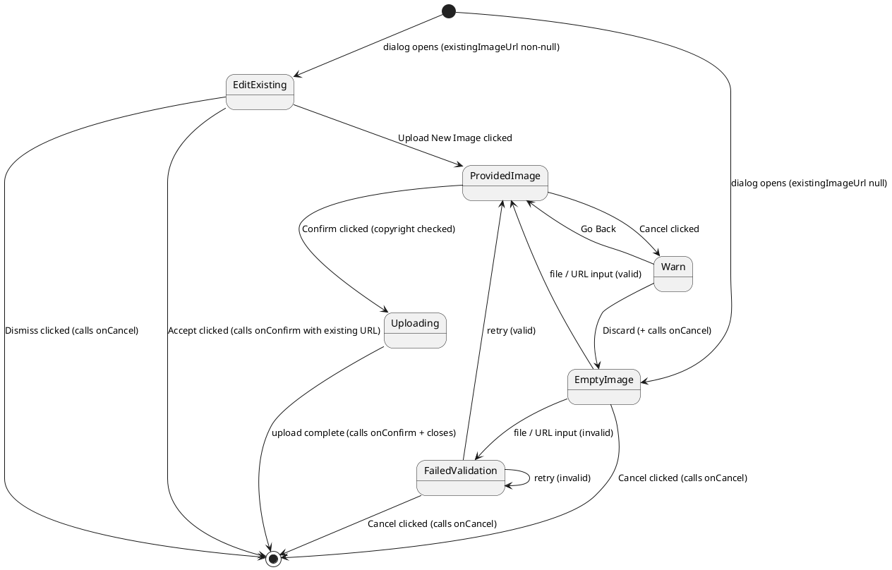

{/* image-upload-dialog.mdx */}
import { Meta, Canvas } from '@storybook/addon-docs/blocks';
import * as Stories from './image-upload-dialog.stories';

<Meta of={Stories} />

# ImageUploadDialog

Full-flow image upload orchestrator for the Arda design system. Manages a multi-state
machine &#8212; **EditExisting**, **EmptyImage**, **ProvidedImage**, **FailedValidation**, **Uploading**, and
**Warn** &#8212; coordinating drop zone, preview editor, copyright gate, progress bar,
and discard guard in a single Dialog surface.

**Organism** &#8212; Canary | Import: `@/components/canary/organisms/shared/image-upload-dialog`

---

## State Machine

The component is driven by `useReducer`. The diagram below shows all states and transitions.



---

## Baked-In Behaviors

### Entry Logic

When the dialog opens (`open` transitions from `false` to `true`), the initial state is determined by `existingImageUrl`:

- **Non-null** `existingImageUrl` &#8594; **EditExisting** state. The dialog opens showing a side-by-side comparison (or tabs on mobile) of the current image alongside an empty "New" panel. The user can accept the existing image unchanged, dismiss, or choose to upload a replacement.
- **Null** `existingImageUrl` &#8594; **EmptyImage** state. The dialog opens showing only the `ImageDropZone`, ready to receive a new image.

Resetting `open` to `false` resets the internal state machine back to this entry logic on the next open.

### EditExisting State

The EditExisting state renders `ImageComparisonLayout` with the existing image on the left and an empty right panel. The layout's built-in action footer exposes three buttons:

- **Accept**: Calls `onConfirm` with an `ImageUploadResult` wrapping the existing URL, then closes. No copyright acknowledgment is required in this path because no new image is being uploaded.
- **Dismiss**: Calls `onCancel` and closes.
- **Upload New Image**: Transitions the state machine to EmptyImage, replacing the comparison view with `ImageDropZone`.

### EmptyImage State

Renders `ImageDropZone`. When the user provides a valid file or URL, the state transitions to ProvidedImage and the drop zone is replaced by `ImagePreviewEditor`. Invalid input transitions to FailedValidation. A Cancel button calls `onCancel` and closes.

### ProvidedImage State

Renders `ImagePreviewEditor` wrapped in `ImageComparisonLayout` when `existingImageUrl` is non-null, or directly when null. Below the editor, `CopyrightAcknowledgment` is always shown. The Confirm button is disabled until `acknowledged` is `true`.

When Confirm is clicked:

1. If `cropData` is present (the user moved, zoomed, or rotated), `getCroppedImage()` is called to render the final pixel crop as a `Blob`.
2. The `Blob` (or original `File` if no crop was applied) is passed to `onUpload(blob)`.
3. On success, `onConfirm(result)` is called with the `ImageUploadResult` and the dialog closes.

### FailedValidation State

Renders an inline error message (`role="alert"`) above a fresh `ImageDropZone` for retry. The error message describes why the previous input was rejected. The user can retry with a new file or URL, or click Cancel to dismiss.

### Uploading State

After Confirm is clicked (copyright checked, crop complete), the dialog transitions to Uploading:

- The footer shows a `Progress` bar and a disabled "Uploading&#8230;" button.
- The progress bar is animated with 50ms ticks over a 1500ms simulated duration (driven by `onUpload`'s async resolution).
- The dialog cannot be dismissed while uploading &#8212; the backdrop click and Escape key are suppressed.

### Warn State (Discard Guard)

If the user clicks Cancel while in ProvidedImage state (an image is staged), the component transitions to Warn rather than immediately dismissing. An `AlertDialog` opens over the main dialog with two actions:

- **Discard**: Clears the staged image, transitions to EmptyImage, and calls `onCancel`.
- **Go Back**: Closes the alert and returns to ProvidedImage, leaving the staged image intact.

This guard prevents accidental data loss for users who have already cropped and positioned an image.

### Upload Pipeline

The full upload pipeline executed on Confirm:

1. If `cropData` is non-null, call `getCroppedImage(imageSrc, pixelCrop, rotation)` to obtain a cropped `Blob`.
2. Call `onUpload(blob)` &#8212; an async function provided by the caller (or the default mock handler in dev).
3. Await the result (an `ImageUploadResult` containing the final URL).
4. Call `onConfirm(result)` to notify the caller.
5. Close the dialog.

### Dependency Injection

Two props allow callers to inject production implementations:

- **`onUpload`**: `(blob: Blob) => Promise<ImageUploadResult>`. Called after cropping to perform the actual upload. Defaults to `defaultUploadHandler` (a mock that returns a picsum URL after ~1.5s) when not provided. Production apps must supply a real implementation.
- **`onCheckReachability`**: `(url: string) => Promise<boolean>`. Called to verify that a URL-input image is reachable before staging it. Defaults to `defaultReachabilityCheck` (returns `true` unless the URL contains the string `"broken"`) when not provided.

Both defaults are intentionally non-functional mocks for Storybook and development. They are production-safe in the sense that they do not make real network calls that could fail in CI, but they must be replaced for any real upload flow.

---

## Playground

Use the Controls panel to toggle `open`, `existingImageUrl`, and `config`. Actions log
`onConfirm` and `onCancel`.

<Canvas of={Stories.Playground} />

---

## Empty Image State

The dialog opens showing `ImageDropZone` &#8212; the entry state when no existing image is present.

<Canvas of={Stories.EmptyImageState} />

---

## Provided Image State

Once an image is staged, `ImagePreviewEditor` replaces the drop zone and
`CopyrightAcknowledgment` appears below. The Confirm button is disabled until the
copyright checkbox is checked.

<Canvas of={Stories.ProvidedImageState} />

---

## Comparison Mode

When `existingImageUrl` is set, `ImageComparisonLayout` wraps the preview editor to show
a side-by-side (desktop) or tabbed (mobile) comparison.

<Canvas of={Stories.ComparisonMode} />

---

## Validation Error

An inline `text-destructive` error message is shown above a fresh `ImageDropZone` when
input fails validation.

<Canvas of={Stories.ValidationError} />

---

## Copyright Gate

The Confirm button remains disabled until the user checks the copyright acknowledgment
checkbox.

<Canvas of={Stories.CopyrightGate} />

---

## Upload Progress

After Confirm is clicked, the footer is replaced by a `Progress` bar and a disabled
"Uploading&#8230;" button.

<Canvas of={Stories.UploadProgress} />

---

## Warn on Discard

Clicking Cancel while an image is staged shows an `AlertDialog` guard with **Discard**
(destructive) and **Go Back** actions.

<Canvas of={Stories.WarnOnDiscard} />

---

## Full Happy Path

Interactive end-to-end: open &#8594; drop file &#8594; preview &#8594; copyright &#8594; confirm
&#8594; progress &#8594; close.

<Canvas of={Stories.FullHappyPath} />

---

## Props

<table>
  <thead>
    <tr>
      <th>Prop</th>
      <th>Category</th>
      <th>Type</th>
      <th>Default</th>
      <th>Description</th>
    </tr>
  </thead>
  <tbody>
    <tr>
      <td><code>config</code></td>
      <td>Init</td>
      <td><code>ImageFieldConfig</code></td>
      <td>Required</td>
      <td>
        Combined static + init field configuration: aspect ratio, accepted formats,
        size limits, and display names.
      </td>
    </tr>
    <tr>
      <td><code>open</code></td>
      <td>Runtime</td>
      <td><code>boolean</code></td>
      <td>Required</td>
      <td>Controls whether the Dialog is open. Transitioning to <code>false</code> resets the internal state machine.</td>
    </tr>
    <tr>
      <td><code>existingImageUrl</code></td>
      <td>Runtime</td>
      <td><code>string | null</code></td>
      <td>Required</td>
      <td>
        Non-null &#8594; dialog opens in EditExisting mode with <code>ImageComparisonLayout</code>.
        Null &#8594; dialog opens in EmptyImage mode showing only the drop zone.
      </td>
    </tr>
    <tr>
      <td><code>onConfirm</code></td>
      <td>Runtime</td>
      <td><code>(result: ImageUploadResult) =&#62; void</code></td>
      <td>Required</td>
      <td>Called with the upload result when the upload completes successfully.</td>
    </tr>
    <tr>
      <td><code>onCancel</code></td>
      <td>Runtime</td>
      <td><code>() =&#62; void</code></td>
      <td>Required</td>
      <td>
        Called when the user cancels &#8212; directly from EmptyImage, FailedValidation, or EditExisting
        states, or after confirming discard in the Warn guard.
      </td>
    </tr>
    <tr>
      <td><code>onUpload</code></td>
      <td>Runtime</td>
      <td><code>(blob: Blob) =&#62; Promise&#60;ImageUploadResult&#62;</code></td>
      <td><code>defaultUploadHandler</code></td>
      <td>
        Upload implementation called after cropping. Production apps must supply a real handler.
        Defaults to a mock that returns a picsum URL after ~1.5s.
      </td>
    </tr>
    <tr>
      <td><code>onCheckReachability</code></td>
      <td>Runtime</td>
      <td><code>(url: string) =&#62; Promise&#60;boolean&#62;</code></td>
      <td><code>defaultReachabilityCheck</code></td>
      <td>
        Reachability check called for URL-input images. Defaults to a mock that returns
        <code>true</code> unless the URL contains <code>"broken"</code>.
      </td>
    </tr>
  </tbody>
</table>

---

## Import

```tsx
import { ImageUploadDialog } from '@/components/canary/organisms/shared/image-upload-dialog';
import type { ImageUploadDialogProps } from '@/components/canary/organisms/shared/image-upload-dialog';
```
