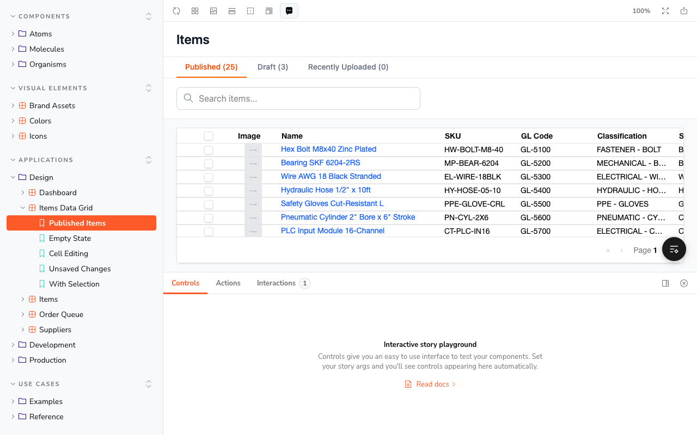
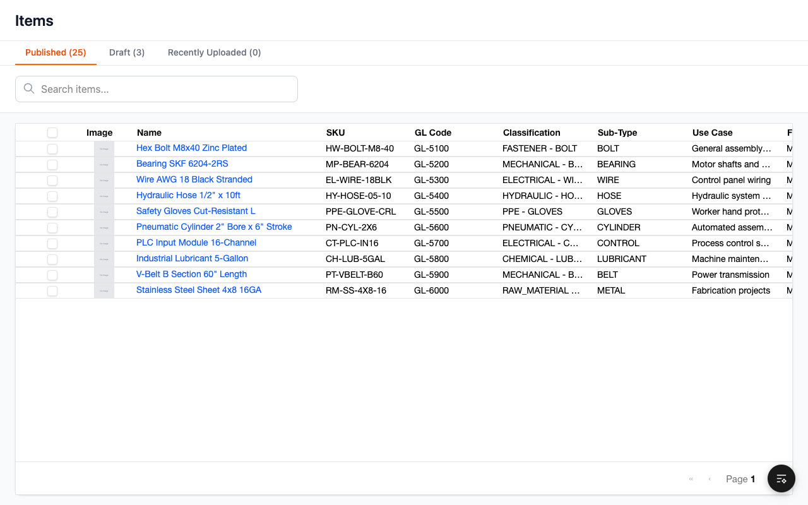
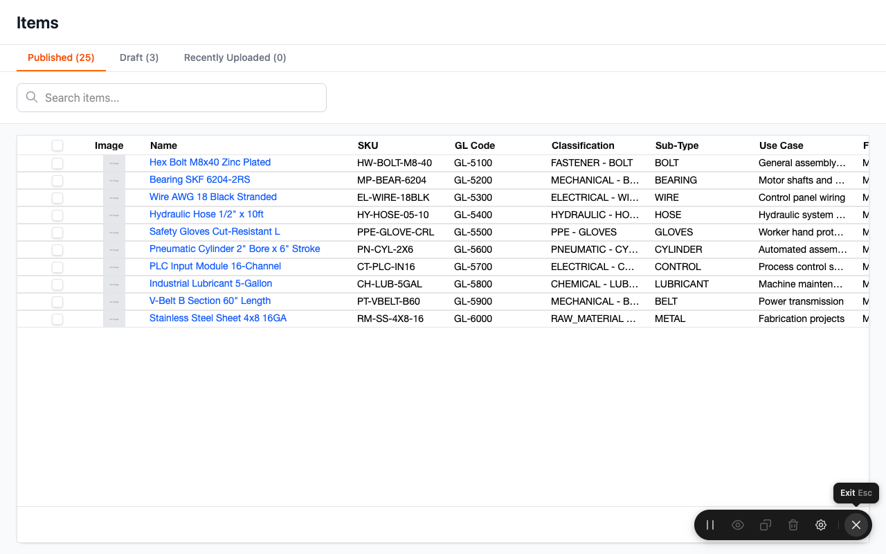
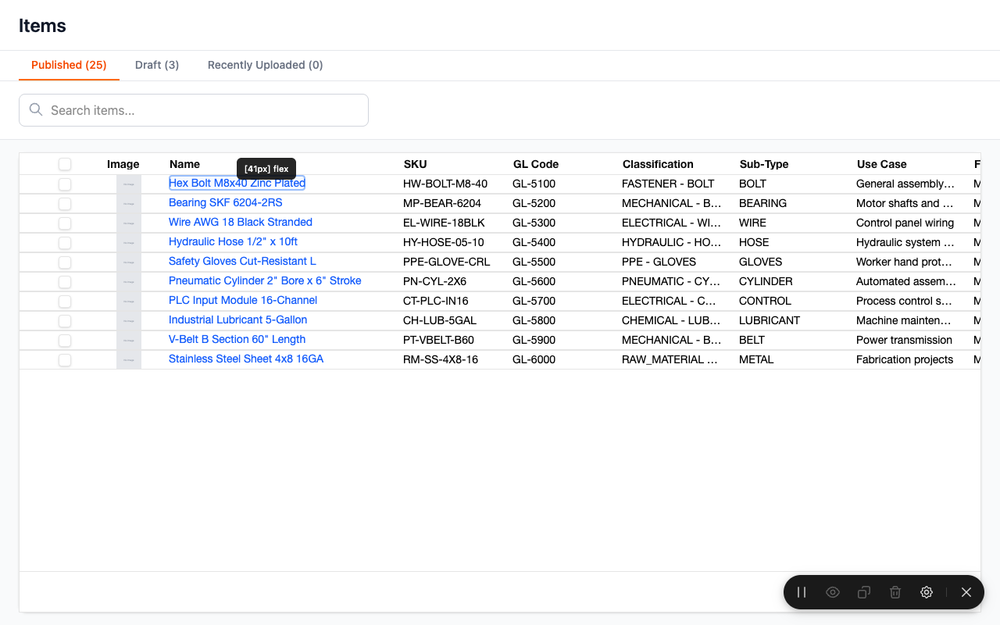
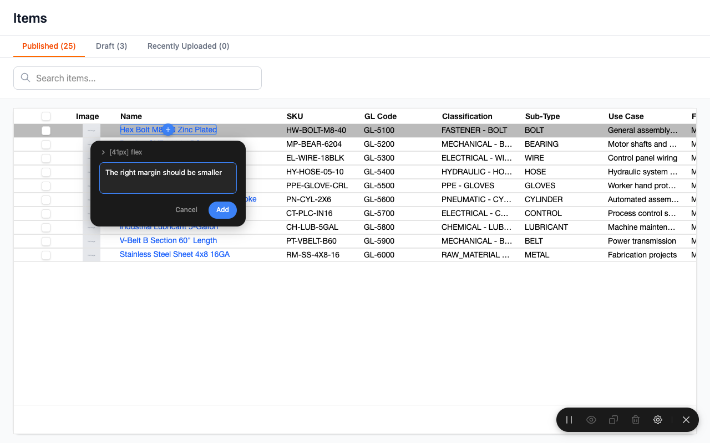
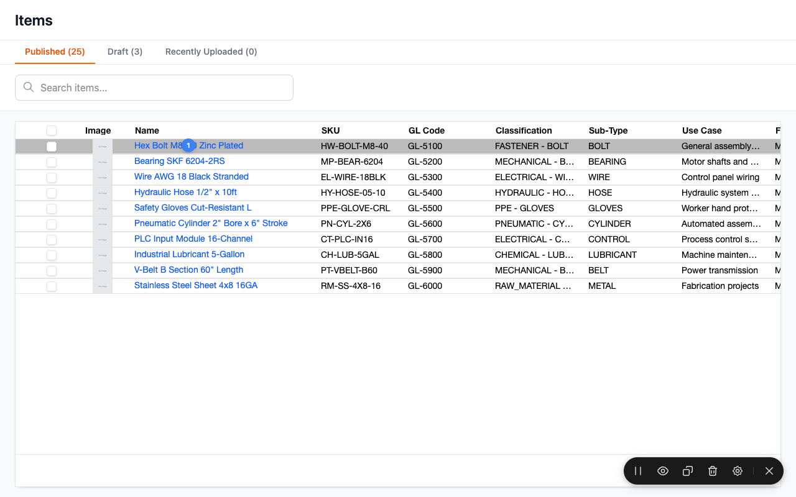

# Storybook Prototype — Access & Feedback Instructions

## Accessing the Prototype

The prototype environment is live at: https://ux-prototype-tau.vercel.app/

- **User:** `arda`
- **Password:** `ArdaSecretPrototypes`

## Leaving Feedback with the Commenting Tool

The prototype includes a built-in commenting overlay (powered by [Agentation](https://agentation.dev)) that lets you annotate any element on the page. Here's how to use it:

### 1. Activate the commenting overlay

Click the **black comment icon** in the Storybook toolbar at the top of the page when viewing any mockup.



This shows a black widget at the bottom-right corner of the screen.



### 2. Open the comment tools

Click on the circle widget to open the comment tools panel, which you can move around the screen. The toolbar provides buttons for pausing annotations, viewing comments, copying, deleting, and accessing settings.



### 3. Point and comment

Hover over any element in the mockup with your mouse. The tool highlights the element and shows its CSS selector information.



Click on the element to open the comment dialog. Type your feedback in the "What should change?" field and click **Add** to submit.



Comments appear as small **blue circles** with a number indicating how many comments are attached to that element.



### 4. Export your comments

To export your comments for a page, navigate to the toolbar and click the **copy icon** (third button from the left). This copies all comments for the current page to your clipboard in markdown format, ready to paste into a GitHub issue or send to a team member.


Example of exported feedback:

```markdown
## Page Feedback: /iframe.html?id=applications-design-items-data-grid--published-items&viewMode=story
**Viewport:** 960x1254

### 1. flex items
**Location:** .ag-header-row > .ag-header-cell > .ag-header-cell-comp-wrapper > .flex
**Feedback:** The right margin should be smaller
```

## Important Notes

- Comments are stored **locally in your browser only** and are kept for **7 days**. They are not synced to a server or shared with other users.
- To share feedback, export your comments using the copy icon and either:
  - Paste them into a **GitHub issue**, or
  - Send them to the team for processing.
- The components and pages in the prototypes **are not tied to the current production application**. They represent upcoming designs for the next phase of UI development.
- New versions of the prototype will be announced in Slack.
